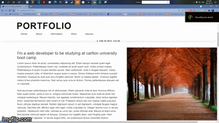

# employe-Hub
MIT 

## Description
Professionl Portfolio webpage to know more about me and my work. Feel free to look around the webpage. 
  ## Table of contents
  - [Description](#description)
  - [Table of contents](#table-of-contents)
  - [Images](#image)
  - [Technologies](#technologies)
  - [License](#license)
  - [Contributing](#contributing)
  - [Questions](#questions)
## Images 
Personal Portfolio Demonstration GIF: 

Portfolio Pic: 

## Youtube 

# Technologies 
- css
- javascript 
- Inquirer
- MySql

## License MIT
I have used a mit License for this application, please see repository for documentation <https://github.com/anthony9292/Team-Generator-/blob/main/License.md>

## Contributing
   anthony9292

## Questions
For questions regarding this application please contact me at:
- E-mail anthon.n08@gmail.com 
- Github:<https://github.com/anthony9292>

    
